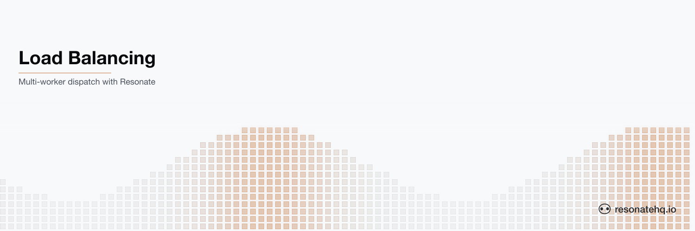

<picture>
  <source media="(prefers-color-scheme: dark)" srcset="./assets/banner-dark.png">
  <source media="(prefers-color-scheme: light)" srcset="./assets/banner-light.png">
  
</picture>

# Worker load balancing

**Resonate Rust SDK**

This example showcases Resonate's automatic service discovery and load balancing capabilities.

Instructions on [How to run this example](#how-to-run-this-example) are below.

## The problem

A single worker or microservice instance will eventually become overwhelmed if there is too much work sent its way in a short amount of time.

There are generally two ways to solve this:

1. Increase the compute capability for the single worker / microservice.
2. Increase the number of worker / microservice instances.

There is an upper limit to the first option, and it is a single point of failure if there is only ever one instance running.

Therefore, the second option tends to be the desired approach, because in theory you can scale the number of instances indefinitely. However, this introduces another problem: service discovery and load balancing — that is, knowing which worker / application node has the capacity to take more work.

But beyond that, what happens if a worker / microservice instance crashes after starting work and making progress on it.

How does the system know it needs to recover that work somewhere else, and where to recover it?

These are distributed system engineering issues that developers are commonly forced to solve again and again.
And often they are forced to mix messy service discovery, load balancing, and recovery logic into their application or business logic, which makes for a very poor developer experience.

## The solution

Resonate has built-in service discovery, load balancing, and recovery. And it provides the developer with a simple RPC API and target schema to make use of these features.

In your worker / microservice you can just specify the group that it belongs to:

```rust
let resonate = Resonate::new(ResonateConfig {
    url: Some("http://localhost:8001".into()),
    group: Some("workers".into()),
    ..Default::default()
});
```

Run as many instances of that worker / microservice as you need.

Then, when you need to call a function on that worker / microservice you use Resonate's RPC API, targeting any worker in that group.

```rust
resonate
    .rpc::<_, ()>(&id, "compute_something", (id.clone(), compute_cost))
    .target("poll://any@workers")
    .spawn()
    .await?;
```

Resonate handles the rest!

You get automatic service discovery, load balancing, and recovery for all the workers in that group.

## About this example

This example demonstrates Resonate's built-in load balancing and recovery capabilities.

As the operator, you will run multiple instances of a worker (`worker.rs`).
The worker contains a single function `compute_something()`.

You will then use the client script (`client.rs`) to start many `compute_something()` executions.

As you invoke more and more executions, you will see them start to spread across the multiple worker instances.

If you kill one of the workers while it is in the middle of handling executions, you will see the executions recover on another worker. The durable `ctx.sleep` survives the crash, so the recovered execution waits out only the remaining time.

If you look at the code on the worker, you will notice that it identifies itself as a member of the `workers` group.

And if you look at the code on the client, you will notice that the invocation of `compute_something()` targets any worker in the `workers` group via `poll://any@workers`.

This example shows that with minimal developer and operator effort, you get load balancing and recovery out of the box with Resonate.

## How to run this example

This example uses [Cargo](https://www.rust-lang.org/tools/install) as the build tool. After cloning, change directory into the project root.

This example application requires that a Resonate Server is running locally.
The Resonate Server acts as a Durable Promise store and a message broker.

```shell
# install the server if you haven't yet
brew install resonatehq/tap/resonate
# start the server
resonate dev
```

If you don't have brew, you can try [one of these other methods of installation](https://docs.resonatehq.io/operate/server-installation).

Run multiple worker instances, each in its own terminal.
We recommend running at least 3 instances to get the best demonstration.

```shell
cargo run --bin worker
```

Run the client script.
The client script does not block on a result from `compute_something()`, so you can run it back to back, as many times as needed.
We recommend running it at least a dozen times to get the best demonstration.

```shell
cargo run --bin client
```

## Learn more

- [Resonate Documentation](https://docs.resonatehq.io)
- [Rust SDK Guide](https://docs.resonatehq.io/develop/rust)
- [Worker Groups and Load Balancing](https://docs.resonatehq.io/concepts/targets)
